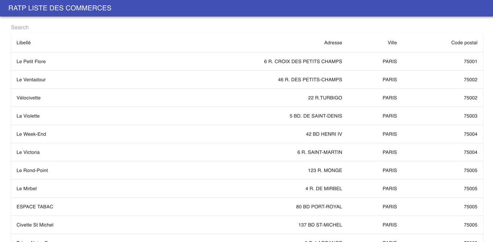
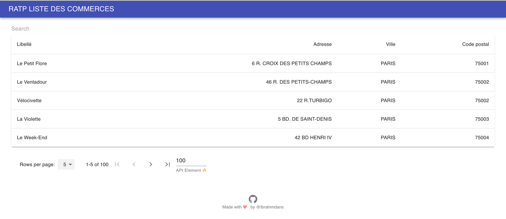
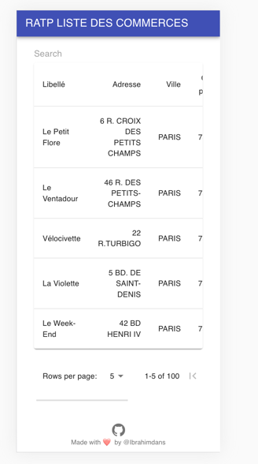

# COMMERCE APP

Pour lancer le projet il faut d'abord faire

### `yarn init`

Ce qui nous créera le fichier .env

#### Puis pour le demarrer

### `yarn start`

#### Pour build le projet

### `yarn build `

# SCREENSHOT

